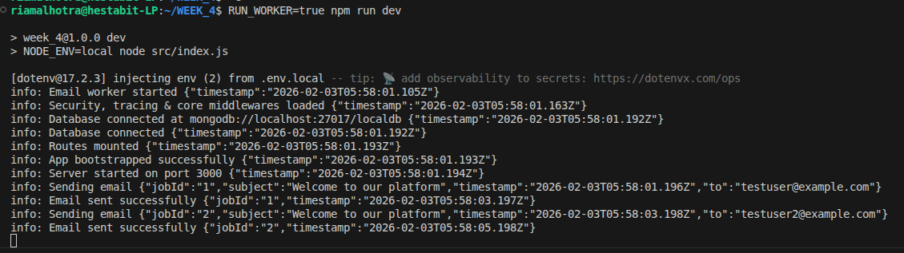
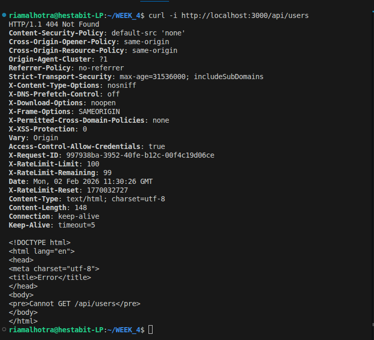
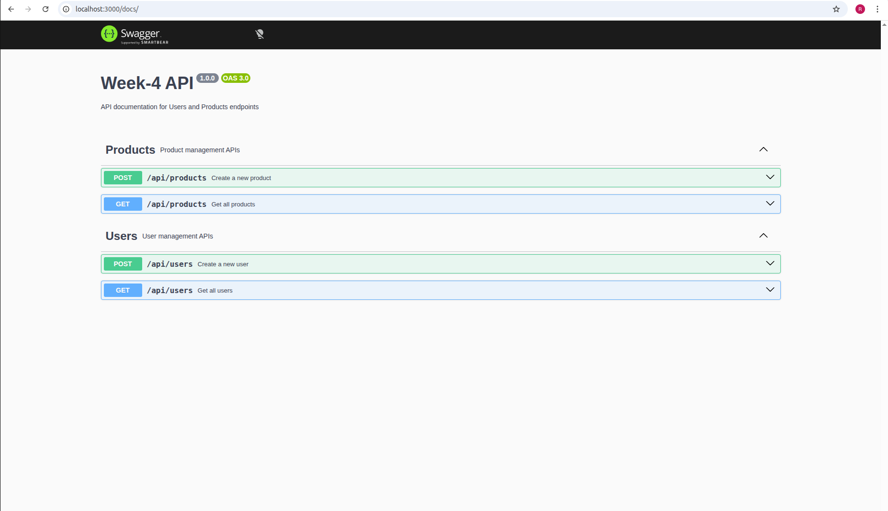
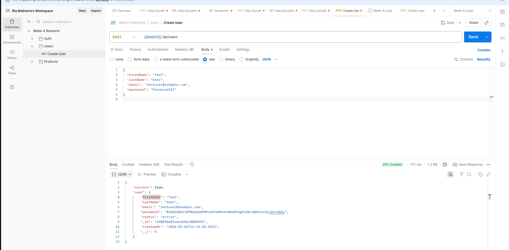
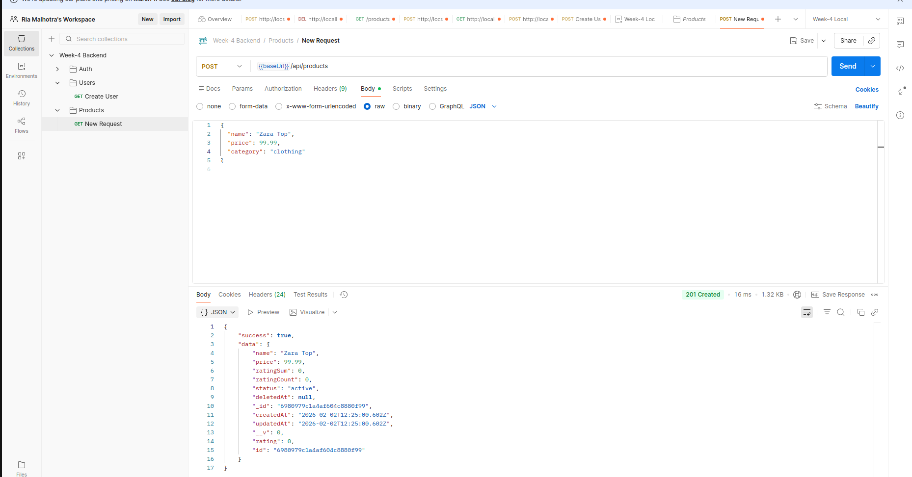
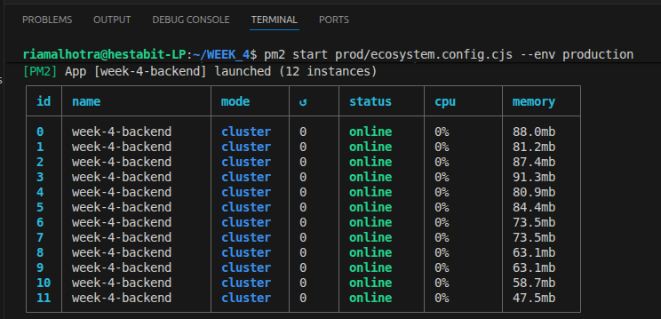

# Deployment Report — Week 4 Backend

## Overview

This document provides a complete deployment and implementation report for the **Week 4 Backend Project**. It demonstrates how the application is production‑ready by showcasing background jobs, request tracing, API documentation, and deployment configuration.

---

## Implemented Features

### 1. Background Jobs (BullMQ)

* Implemented background job processing using **BullMQ**
* Job type: **Email Notification / Async Task**
* Queue-based processing with retries and backoff
* Separate worker process
* Logs generated for job lifecycle

**Key Files:**

```
/jobs/email.job.js
```

**Screenshot 1: Worker Logs**



---

### 2. Request Tracing & Logging

* Every incoming request is assigned a unique **X-Request-ID**
* Request ID is returned in response headers
* Same request ID is logged across middleware, controllers, and services
* Enables end‑to‑end request tracing

**Key Files:**

```
/utils/tracing.js
/middlewares/requestLogger.middleware.js
/logs/*.log
```

**Screenshot 2: Logs with Request ID**




---

### 3. API Documentation

#### 3.1 Swagger Documentation

* API documentation auto-generated using **Swagger**
* Covers Users and Products APIs
* Supports request/response schemas

**Swagger URL:**

```
http://localhost:3000/docs
```

**Screenshot 3: Swagger UI**



---

#### 3.2 Postman Collection

* Postman collection created with structured folders:

  * Auth
  * Users
  * Products
* Environment variables used (`{{baseUrl}}`)
* Requests tested successfully

**Screenshot 4: Postman Collection Structure**



**Screenshot 5: Successful API Request**

**user:**


**prod:**



---

### 4. Deploy‑Ready Production Setup

* Application configured for production deployment
* **PM2** used for process management
* Cluster mode enabled for scalability

**Folder Structure:**

```
prod/
 ├── ecosystem.config.cjs
 └── .env.example
```

**Screenshot 6: PM2 Cluster Status**



---


## Conclusion

The backend application meets all Week‑4 requirements and is fully production‑ready. It demonstrates asynchronous processing, observability through tracing and logs, comprehensive API documentation, and scalable deployment configuration using PM2.

