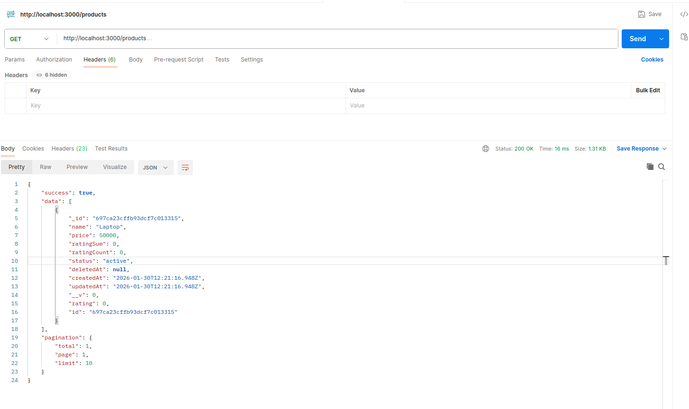
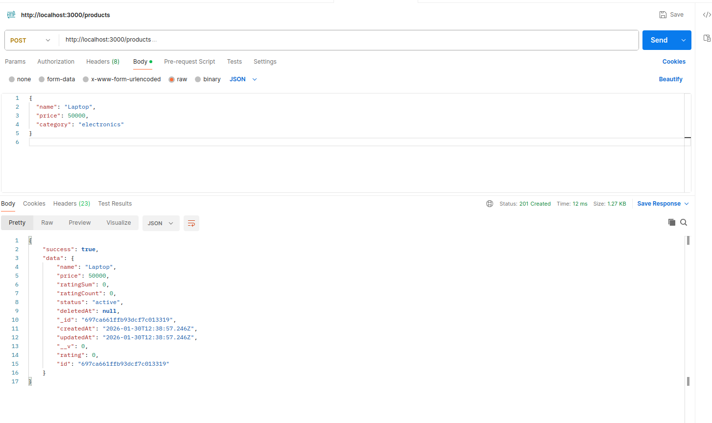
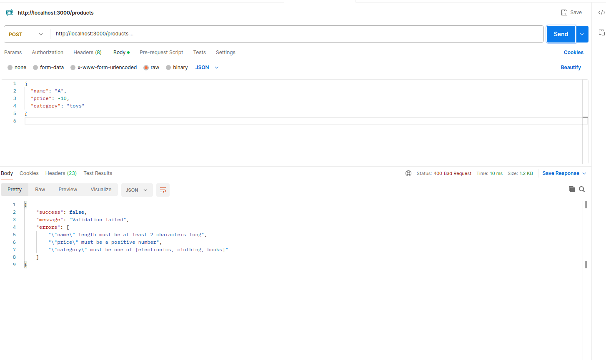
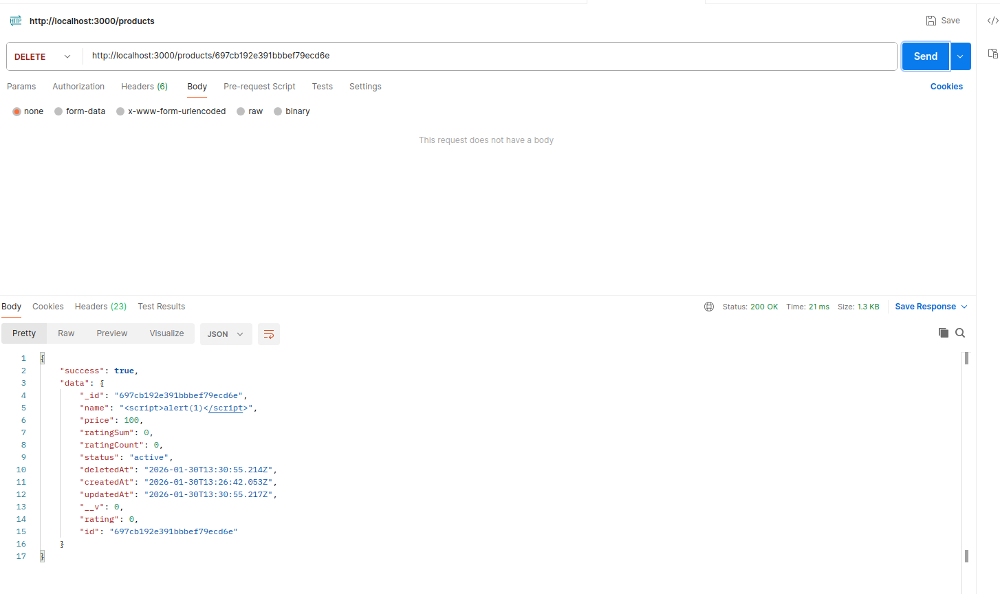
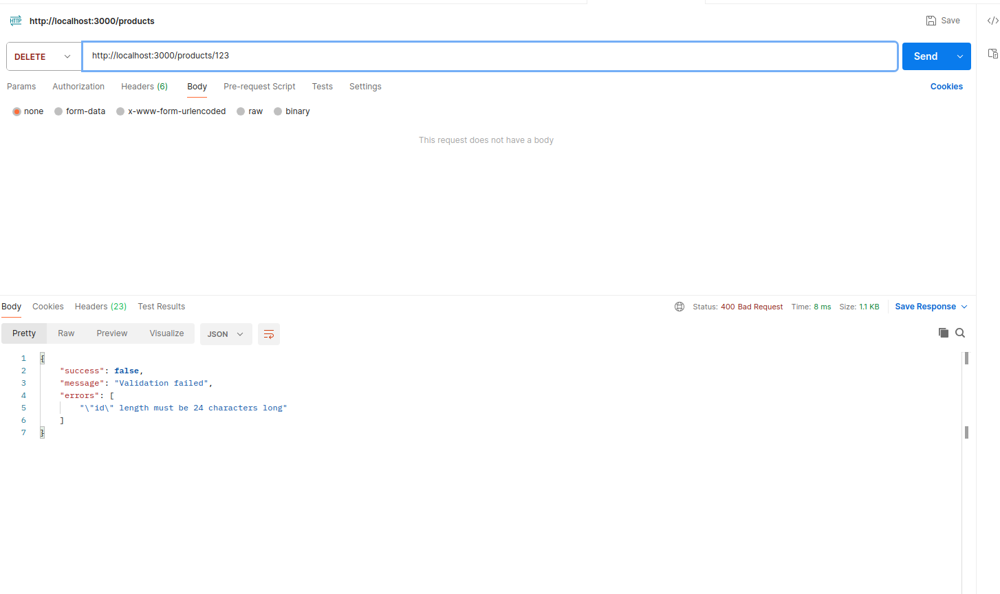
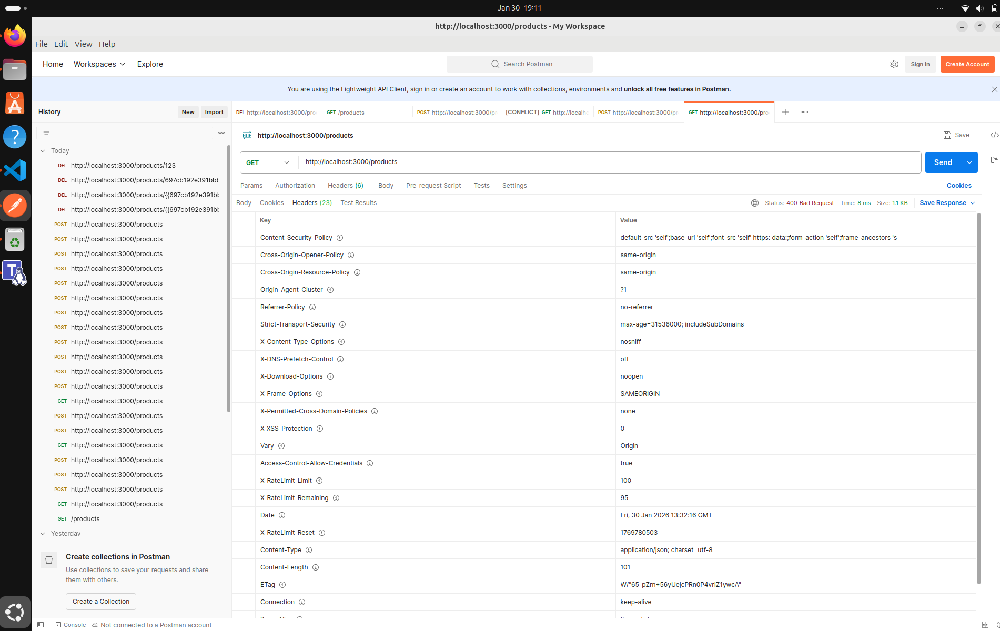

# Security Report — Day 4

## DAY 4 — SECURITY, VALIDATION, RATE LIMITING & HARDENING

---

## 1. Overview

Day 4 focuses on securing backend APIs by applying industry best practices for input validation, request sanitization, rate limiting, and HTTP security hardening. The objective is to protect the application from common web vulnerabilities and ensure that only safe, valid requests are processed.

---

## 2. Security Features Implemented

### 2.1 Input Validation

Validation is implemented using centralized middleware to ensure that incoming requests strictly follow the expected schema.

---

#### GET /products

**Purpose:** Verify that the API is reachable and working correctly.

**Expected Result:**

* Status: 200 OK
* Empty or populated product list

**Screenshot:**



---

#### POST /products — Valid Input

**Purpose:** Test successful product creation.

**Request Body:**

```json
{
  "name": "laptop",
  "price": 50000,
  "category": "electronics"
}
```

**Expected Result:**

* Status: 201 Created
* Product data returned

**Screenshot:**



---

#### POST /products — Invalid Input

**Purpose:** Trigger validation errors.

**Request Body:**

```json
{
  "name": "A",
  "price": -10,
  "category": "toys"
}
```

**Expected Result:**

* Status: 400 Bad Request
* Validation error message

**Screenshot:**



---

### 2.2 NoSQL Injection Prevention

**Threat:** Attackers attempt to manipulate MongoDB queries using operators such as $gt, $ne, or $or.

#### POST /products — NoSQL Injection Attempt

**Request Body:**

```json
{
  "name": { "$gt": "" },
  "price": 100,
  "category": "electronics"
}
```

**Expected Result:**

* Status: 400 Bad Request
* Request rejected by validation middleware

**Screenshot:**


---

### 2.3 Cross-Site Scripting (XSS) Prevention

**Threat:** Injection of malicious JavaScript via input fields.

#### POST /products — XSS Attempt

**Request Body:**

```json
{
  "name": "<script>alert(1)</script>",
  "price": 100,
  "category": "electronics"
}
```

**Expected Result:**

* Status: 400 Bad Request
* Validation error or sanitization

**Screenshot:**


---

### 2.4 DELETE /products/:id — Validation Testing

#### DELETE /products/:id — Valid ID

**Purpose:** Ensure valid deletion requests are processed correctly.

**Steps:**

1. Copy the _id from a successful POST response
2. Send DELETE request

**Expected Response (200):**

```json
{
  "success": true,
  "data": { "_id": "<productId>" }
}
```

**Screenshot:**



---

#### DELETE /products/:id — Invalid ID

**URL:**

```
/products/123
```

**Expected Response (400):**

```json
{
  "success": false,
  "message": "Validation failed",
  "errors": ["\"id\" length must be 24 characters long"]
}
```

**Screenshot:**



---

### 2.5 Security Headers (Helmet)

Helmet middleware is used to apply secure HTTP headers.

**Headers Added:**

* X-Frame-Options
* X-Content-Type-Options
* X-XSS-Protection
* Strict-Transport-Security
* Content-Security-Policy

**Screenshot:**



---

## 3. Conclusion

By implementing layered security controls such as schema validation, injection prevention, security headers, and strict request handling, the API is protected against common attack vectors. These measures significantly improve the robustness, reliability, and security posture of the backend system.

---
